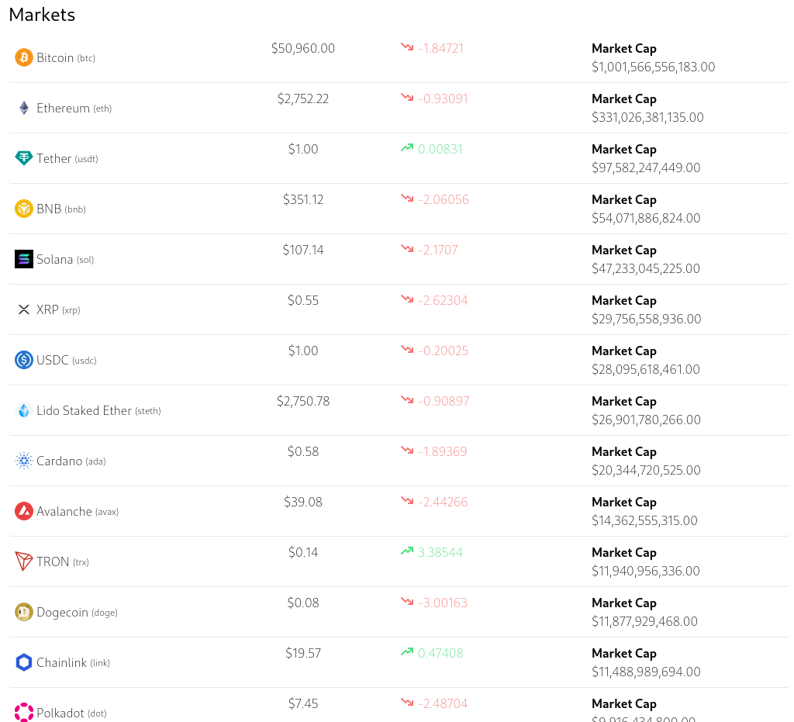
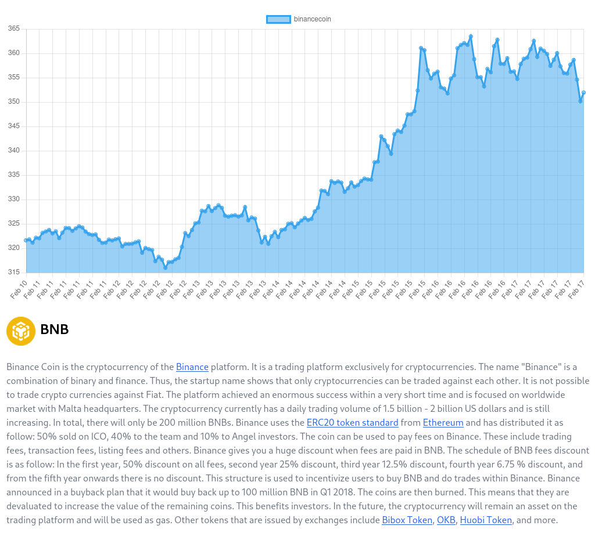
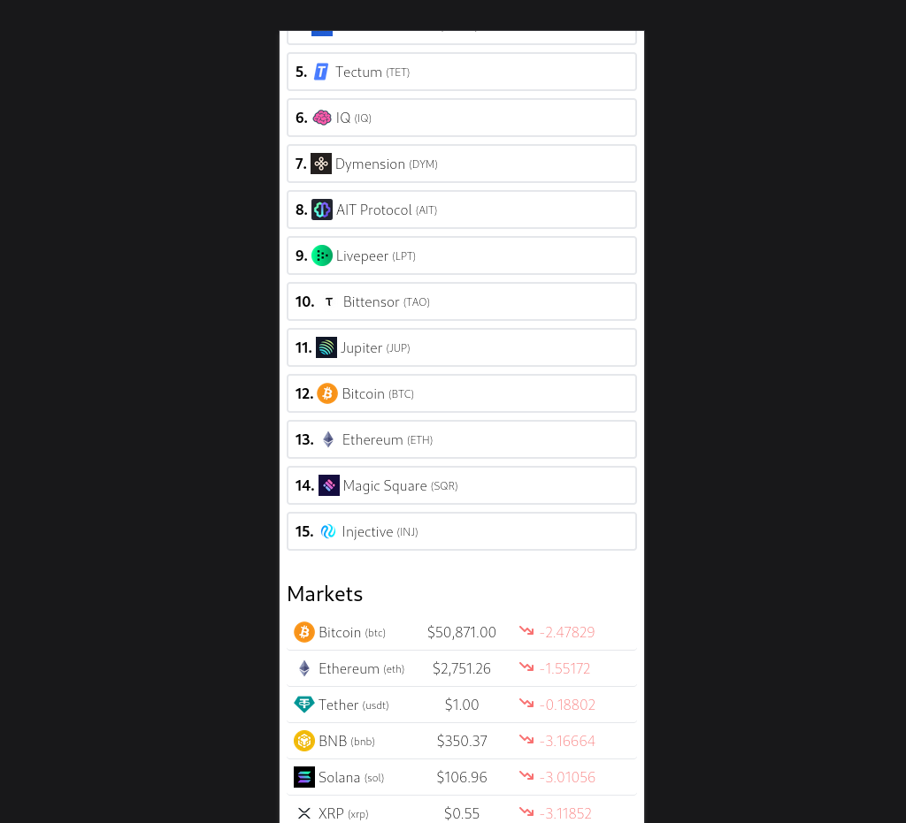

# Live Crypto App

DENARO

## Overview

The Live Crypto App is a web application that provides real-time information about various cryptocurrencies and their prices. It offers users a convenient way to track the performance of their favorite digital assets and stay updated with the latest trends in the cryptocurrency market.

## Features

- **Real-Time Data**: The app fetches live data from reliable sources to ensure that users have access to the most up-to-date information about cryptocurrency prices.

- **Detailed Information**: Users can view detailed information about individual cryptocurrencies, including price charts, market cap, trading volume, and historical data.

- **Responsive Design**: The app is designed to be responsive and accessible across a variety of devices, including desktops, tablets, and mobile phones.

## Technologies Used

- **Frontend**:React.js
- **Data Sources**: API integration with popular cryptocurrency data providers such as CoinGecko or CoinMarketCap.

## Installation

To run the Live Crypto App locally, follow these steps:

1. Clone the repository to your local machine:

2. Excute the following command: 'npm install'

3. Then type:"npm run dev"
